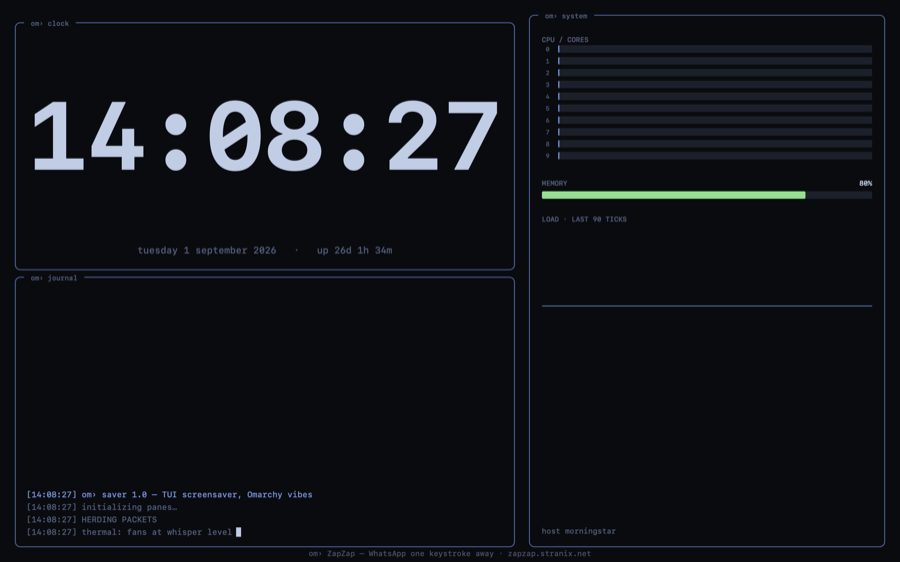

<p align="center">
  
</p>

<h1 align="center">om› saver</h1>

<p align="center">
  <b>Un économiseur d'écran TUI pour macOS. Ambiance Omarchy, vraies stats système, zéro dépendance.</b><br>
  <sub>Membre de l'<a href="https://omfi.stranix.net">OmSuite</a> — de petits outils natifs qui donnent à votre Mac des airs de tiling-WM.</sub>
</p>

<p align="center">
  
  
  
  
</p>

---

## Ce que c'est

OmSaver transforme un Mac inactif en tableau de bord de terminal vivant : une
horloge géante monospace, de la vraie télémétrie (barres CPU par cœur, jauge
mémoire, sparkline de charge, échantillonnées en direct depuis le noyau) et un
journal défilant d'opérations savamment fictives (`HERDING PACKETS`,
`DEFRAGMENTING THE AETHER`…), le tout dans l'esthétique
[Omarchy](https://omarchy.org) — panes sombres, fines bordures bleues, gaps
façon Hyprland. Un seul fichier Swift, AppKit uniquement, aucun réseau, ~200 Ko.

## Structure du repo

```
omsaver/
├── README.md                  ← vous êtes ici
├── LICENSE                    ← MIT
├── build.sh                   ← TOUT le build : compile, assemble le bundle
│                                .saver, signe, installe. Pas de projet Xcode.
├── Sources/
│   └── OmSaverView.swift      ← TOUT le code : une classe, OmSaverView,
│                                abondamment commentée — c'est le fichier à
│                                lire pour comprendre le projet.
├── assets/
│   └── omsaver.png            ← la capture d'écran ci-dessus
└── build/                     ← produit par build.sh (ignoré par git)
    └── OmSaver.saver/         ← le bundle final, prêt à installer
```

## Builder et installer

Prérequis : les Command Line Tools d'Apple (`xcode-select --install`), rien
d'autre. Ensuite :

```console
$ git clone https://github.com/stranix79/omsaver.git
$ cd omsaver
$ ./build.sh install
✓ installé — Réglages Système → Économiseur d'écran → OmSaver
```

`./build.sh` seul construit `build/OmSaver.saver` sans l'installer.
Sinon, sans compiler : téléchargez `OmSaver.saver.zip` dans les
[Releases](https://github.com/stranix79/omsaver/releases), dézippez,
double-cliquez `OmSaver.saver` — macOS propose de l'installer.

## Comment ça marche sous macOS

Si vous venez du C, de Python ou de VB.NET, voici les mécanismes propres à la
plateforme qu'illustre ce projet. Les fichiers sources détaillent chacun de
ces points en commentaires — ceci est la vue d'ensemble.

### Un .saver n'est pas un programme, c'est un plugin

Il n'y a pas de `main()` dans ce projet, et ce n'est pas un oubli. Un
économiseur d'écran macOS est un **bundle** `.saver` : un simple dossier avec
une structure convenue (`Contents/MacOS/` pour le binaire, `Contents/Info.plist`
pour les métadonnées) que le Finder affiche comme un fichier unique. Le binaire
qu'il contient est un Mach-O de type *bundle* (`MH_BUNDLE`) — l'équivalent
d'une `.dll`/`.so` chargeable dynamiquement, pas un exécutable.

Quand l'écran se met en veille, un processus système, **`legacyScreenSaver`**,
charge ce bundle (via `dlopen`), lit dans l'`Info.plist` la clé
`NSPrincipalClass` — ici `OmSaverView` ([build.sh:69](build.sh)) — instancie
cette classe et lui confie une fenêtre plein écran. C'est pour ça que la classe
porte l'attribut `@objc(OmSaverView)`
([Sources/OmSaverView.swift:40](Sources/OmSaverView.swift)) : il fige son nom
côté runtime Objective-C pour que la chaîne du plist retrouve la classe Swift.

Conséquence pratique : votre code ne « tourne » jamais tout seul. Le système
appelle vos méthodes ; vous ne contrôlez ni le démarrage, ni la boucle
d'événements. C'est de l'**inversion de contrôle**, comme un contrôle
personnalisé en VB.NET dont le framework appelle `OnPaint`.

### Le cycle de vie : ScreenSaverView

`OmSaverView` hérite de `ScreenSaverView` (framework `ScreenSaver`), qui impose
trois moments ([Sources/OmSaverView.swift:41](Sources/OmSaverView.swift)) :

1. **`init(frame:isPreview:)`** — construction. `isPreview` vaut `true` quand
   la vue est la petite vignette des Réglages Système : même code, écran
   minuscule (d'où le facteur `scale` calculé dans `draw`).
2. **`animateOneFrame()`** — appelé par un timer système au rythme choisi via
   `animationTimeInterval` (ici 8 fois par seconde). C'est la « boucle de
   jeu » : on y met à jour l'*état* (échantillonner le CPU, ajouter une ligne
   au journal) puis on demande un réaffichage avec `needsDisplay = true`.
3. **`draw(_:)`** — appelé par AppKit quand la vue doit se repeindre. On y
   *dessine* l'état, et rien d'autre : la séparation état/rendu est la règle
   du framework, car `draw` peut être invoqué à tout moment.

Deux pièges AppKit à connaître en lisant `draw` : le dessin est en **mode
immédiat** (`setFill()` puis `fill()` agissent sur un contexte graphique
implicite, très proche de GDI+), et le repère a son **origine en bas à
gauche, Y vers le haut** — l'inverse de VB.NET et du HTML.

### Les vraies stats : parler au noyau via Mach

Les barres CPU et la jauge RAM ne sont pas décoratives. La méthode
`sampleCPU()` ([Sources/OmSaverView.swift:129](Sources/OmSaverView.swift))
appelle deux API C du noyau — l'équivalent macOS de lire `/proc/stat` et
`/proc/meminfo` sous Linux :

- **`host_processor_info`** renvoie, par cœur, des compteurs de ticks
  *cumulés depuis le boot* ; la charge instantanée se calcule par différence
  entre deux échantillons. Le buffer est alloué par le noyau et doit être
  rendu à la main (`vm_deallocate`) — ARC, le ramasse-miettes de Swift, ne
  gère pas cette mémoire-là. Les opérateurs `&+`/`&-` font de l'arithmétique
  modulo comme en C, car ces compteurs 32 bits débordent et Swift, lui,
  plante sur un dépassement d'entier ordinaire.
- **`host_statistics64`** remplit une struct de compteurs de pages mémoire ;
  la formule *actives + wired + compressées* est celle du Moniteur d'activité.

### Le build sans Xcode

`build.sh` remplace tout un projet Xcode par 90 lignes de shell : deux
compilations (`swiftc -emit-object` pour arm64 et x86_64, car `-parse-as-library`
dit au compilateur qu'il n'y a pas de `main`), un linkage `clang -bundle` qui
produit le Mach-O chargeable, un `lipo` qui fusionne les deux architectures en
**binaire universel**, la génération de l'`Info.plist`, puis une **signature**
`codesign` — un certificat de développeur si le trousseau en a un, sinon une
signature *ad hoc* (`--sign -`), suffisante pour sa propre machine.
L'installation, elle, est une simple copie : les économiseurs de l'utilisateur
vivent dans `~/Library/Screen Savers/`.

## Pourquoi c'est gratuit ?

Parce qu'un économiseur d'écran est un panneau publicitaire 😄 — OmSaver est
la moitié gratuite de l'**OmSuite**, une série de petits utilitaires payants
dans le même esprit :

| | | |
|---|---|---|
| **OmFi** | panneau Wi-Fi au clavier — scan, connexion, partage QR, bascule DNS, graphes | [omfi.stranix.net](https://omfi.stranix.net) |
| **OmDash** | les signes vitaux du système d'un coup d'œil | *bientôt* |
| **OmWin** | les raccourcis Omarchy pour vos fenêtres | *bientôt* |

Du même établi : [ZapZap](https://zapzap.stranix.net) (WhatsApp à un raccourci
près) et [Sygnet](https://sygnet.app) (synchro de favoris qui inclut vraiment
Safari). Tout est sur [apps.stranix.net](https://apps.stranix.net).

## Vie privée

OmSaver lit vos statistiques CPU/mémoire localement et les affiche. C'est
tout. Aucune requête réseau, aucune télémétrie, aucun fichier écrit. Les
« scans réseau » du journal sont de la pure fiction théâtrale.

## Licence

MIT © 2026 [Stranix](https://apps.stranix.net) — Gilles Fauvie.
Fabriqué en Belgique, une invocation de `swiftc` à la fois.
